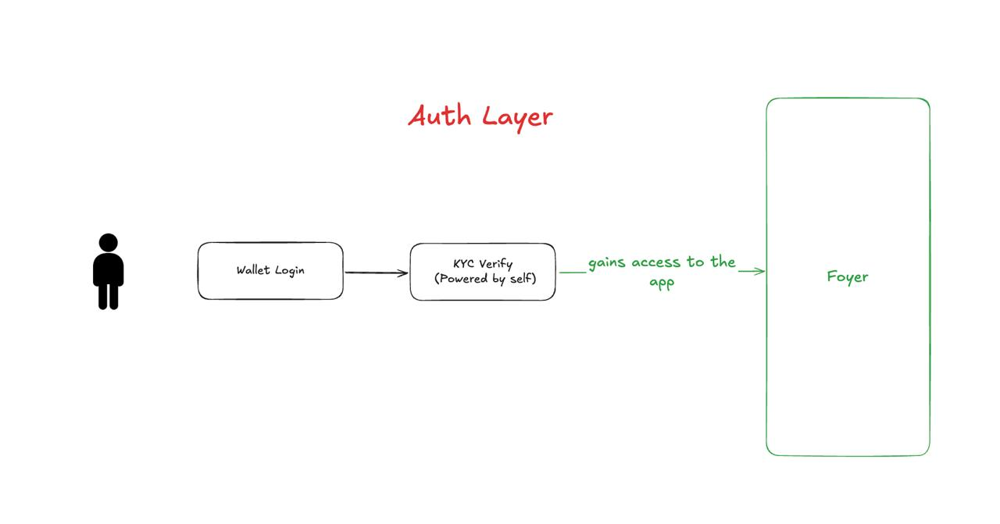
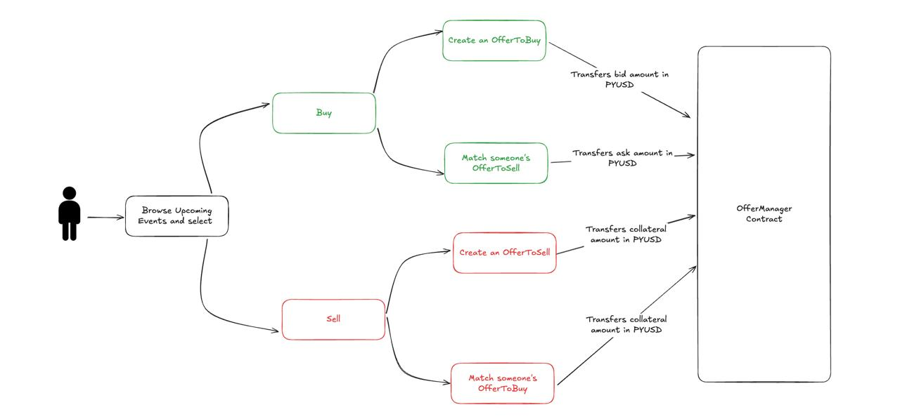
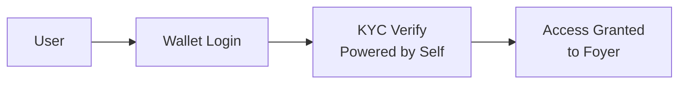
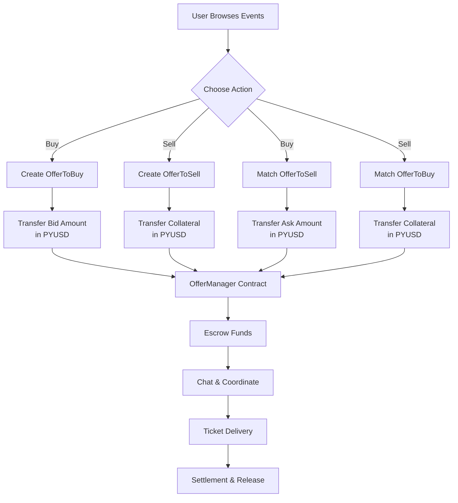

# 🎫 Foyer

<div align="center">


*Your gateway to unforgettable experiences through secure, blockchain-powered ticket trading*

[](https://opensource.org/licenses/MIT)
[](https://www.typescriptlang.org/)
[](https://nextjs.org/)
[](https://soliditylang.org/)
[](https://ethereum.org/)


[🚀 Live Demo](#) • [📖 Documentation](#installation) • [🤝 Contributing](#contributing) • [💬 Community](#support)

</div>

---

## 🌟 What is Foyer?

Foyer is a  **decentralized secondary marketplace for event tickets** that solves the major problems plaguing the traditional ticket resale industry. Built on blockchain technology, Foyer eliminates fraud, reduces fees, and creates a trustworthy environment for ticket trading.

### 🎯 The Problem We Solve

The traditional ticket resale market is broken:
- **Delayed payouts**: Weeks of waiting
- **High Fees**: Platforms and payment gateways charge 15-25% in fees
- **Lack of Trust**: No way to verify seller legitimacy

### 💡 Our Solution

Foyer leverages blockchain technology to create a **fast, trustless, transparent, and secure** ticket marketplace:

- **🔒 Smart Contract Escrow**: Funds are held securely until ticket delivery is confirmed
- **🆔 KYC Verification**: All users are identity-verified through Self.xyz integration
- **💰 Collateral System**: Sellers stake collateral to ensure they deliver tickets
- **⚖️ Dispute Resolution**: Fair, transparent dispute handling by verified admins
- **💬 Direct Communication**: Built-in chat system for buyer-seller coordination


### 🎪 How It Works

#### 🔐 Authentication Flow


**Step-by-Step Authentication:**
1. **Wallet Connection**: User connects their Web3 wallet (MetaMask, WalletConnect, etc.)
2. **KYC Verification**: Complete identity verification through Self.xyz integration
3. **Access Granted**: Gain full access to Foyer marketplace features

#### 🎫 Ticket Trading Flow


**Complete Trading Process:**
1. **Browse Events**: Users explore upcoming events and available tickets
2. **Choose Action**: 
   - **Buy Path**: Create buy offers or accept existing sell offers
   - **Sell Path**: Create sell offers with collateral requirements
3. **Smart Contract Execution**: 
   - **Buy Offers**: Transfer bid amount in PYUSD to escrow
   - **Sell Offers**: Transfer collateral amount to ensure delivery
4. **Secure Settlement**: Funds held in OfferManager contract until completion
5. **Communication**: Built-in chat facilitates ticket transfer coordination
6. **Final Settlement**: Automatic fund release after successful delivery
7. **Dispute Protection**: Admin mediation available if issues arise

### 🌍 Target Market

- **Primary Users**: Concert-goers, sports fans, theater enthusiasts
- **Secondary Users**: Event organizers, ticket brokers, venue operators

### ✨ Key Features

- 🔐 **Decentralized & Secure** - Smart contract-powered transactions with escrow protection
- 🆔 **KYC Integration** - Self.xyz powered identity verification for trusted trading
- 💬 **Real-time Chat** - Socket.io powered messaging between buyers and sellers
- 💰 **PYUSD Payments** - Stable cryptocurrency payments with collateral system


### 🚀 Why Foyer is Different

| Traditional Platforms | Foyer |
|----------------------|-------|
| 15-25% platform fees | 2-5% transparent fees |
| No seller verification | Mandatory KYC for all users |
| Limited buyer protection | Smart contract escrow + collateral |
| Centralized control | Decentralized governance |
| Opaque pricing | Transparent, on-chain transactions |
| No direct communication | Built-in secure messaging |
| Single payment method | Multiple crypto payment options |


---

## 🏗️ Architecture & Flow Diagrams

### 📊 System Architecture

Foyer follows a modern full-stack architecture with clear separation of concerns:

```
┌─────────────────┐    ┌─────────────────┐    ┌─────────────────┐
│   Frontend      │    │    Backend      │    │  Smart Contracts│
│   (Next.js)     │◄──►│  (Node.js/TS)   │◄──►│   (Solidity)    │
│                 │    │                 │    │                 │
│ • React 19      │    │ • Express API   │    │ • EventManager  │
│ • Wagmi/Viem    │    │ • Socket.io     │    │ • OfferManager  │
│ • RainbowKit    │    │ • MongoDB       │    │ • KYCVerifier   │
│ • Tailwind CSS  │    │ • Ethers.js     │    │ • AdminManager  │
└─────────────────┘    └─────────────────┘    └─────────────────┘
```

### 🔧 Tech Stack

#### Frontend
- **Framework**: Next.js 15 with App Router
- **Language**: TypeScript 5
- **Styling**: Tailwind CSS 4
- **Web3**: Wagmi v2, Viem, RainbowKit
- **Real-time**: Socket.io Client
- **State Management**: React Query (TanStack Query)

#### Backend
- **Runtime**: Node.js with TypeScript
- **Framework**: Express.js 5
- **Database**: MongoDB with Mongoose
- **Real-time**: Socket.io Server
- **Blockchain**: Ethers.js v5
- **File Storage**: Pinata IPFS
- **Authentication**: JWT with wallet signatures

#### Smart Contracts
- **Language**: Solidity ^0.8.13
- **Framework**: Foundry
- **Networks**: Ethereum Sepolia, Celo Sepolia, Arbitrum Sepolia
- **Standards**: OpenZeppelin contracts
- **KYC**: Self.xyz integration

### 🔄 Technical Flow Details

#### Authentication Layer


#### Trading Flow Architecture


#### Smart Contract Interaction Flow
1. **User Authentication**: Wallet signature → KYC verification → Platform access
2. **Offer Creation**: User interaction → Frontend validation → Smart contract call
3. **Fund Escrow**: PYUSD transfer → OfferManager contract → Secure holding
4. **Match Making**: Offer acceptance → Contract execution → Fund allocation
5. **Settlement**: Delivery confirmation → Automatic release → Transaction complete

---

## 📋 Usage & Examples

### 🎪 For Event Organizers


### 🎫 For Ticket Sellers

**Example: Sarah has extra Taylor Swift tickets**
1. **Connect Wallet**: Links her MetaMask wallet to the platform
2. **Complete KYC**: Verifies identity through Self.xyz (one-time process)
3. **List Tickets**: Posts 2 floor seats for $800 each with $400 collateral per ticket
4. **Chat with Buyers**: Discusses delivery method with interested buyers
5. **Deliver & Settle**: Transfers tickets and receives $1,200 total payment

**Seller Protection**: If Sarah doesn't deliver, she loses her $400 collateral per ticket

### 🛒 For Ticket Buyers

**Example: Mike wants to attend a concert**
1. **Browse Events**: Searches for "Coldplay Los Angeles" in the Music category
2. **Compare Offers**: Views 15 available listings with transparent pricing
3. **Make Purchase**: Buys 2 tickets for $600 total through smart contract
4. **Secure Payment**: Funds held in escrow until ticket delivery confirmed
5. **Receive Tickets**: Gets digital tickets via email/app, confirms receipt

**Buyer Protection**: If tickets aren't delivered, Mike gets full refund + seller's collateral


## 🔐 Smart Contracts

### Core Contracts

| Contract | Purpose 
|----------|---------
| `AdminManager` | Role-based access control |
| `EventManager` | Event creation and management
| `OfferManager` | Ticket offer lifecycle |
| `KYCVerifier` | Identity verification |
| `KYCRelayer` | Cross-chain KYC relay | 

### Key Features

- **Escrow System**: Automatic fund holding and release
- **Collateral Protection**: Sellers stake collateral to ensure delivery
- **Dispute Resolution**: Admin-mediated conflict resolution
- **Event Lifecycle**: Complete event management from creation to completion

### Contract Addresses

```typescript
// Ethereum Sepolia
ADMIN_MANAGER_ADDRESS = "0xd7312bfbc95a459305393d7795d966aebeef78aa"
// https://sepolia.etherscan.io/address/0xd7312bfbc95a459305393d7795d966aebeef78aa

EVENT_MANAGER_ADDRESS = "0x2fdd630810692642ee03f881df712c212c982f70"
// https://sepolia.etherscan.io/address/0x2fdd630810692642ee03f881df712c212c982f70

OFFER_MANAGER_ADDRESS = "0x1198c36dfc9dd734afce45610708473e973c199d"
// https://sepolia.etherscan.io/address/0x1198c36dfc9dd734afce45610708473e973c199d

// Celo Sepolia
KYC_VERIFIER_ADDRESS = "0x1da4235ba09377415cb5105a7d4749b152cc63af"
https://celo-sepolia.blockscout.com/address/0x1DA4235bA09377415cb5105A7d4749b152cc63AF

KYC_RELAYER_ADDRESS = "0x61f3db7fcc108a5cca70b71795eb333ca8ed7a52"
//https://celo-sepolia.blockscout.com/address/0x61f3db7fcc108a5cca70b71795eb333ca8ed7a52

```

---


##  Acknowledgments

- **Self.xyz** for KYC infrastructure
- **OpenZeppelin** for secure smart contract libraries
- **Foundry** for excellent development tooling
- **RainbowKit** for seamless wallet integration
- **Pinata** for IPFS storage solutions

---

<div align="center">


</div>
